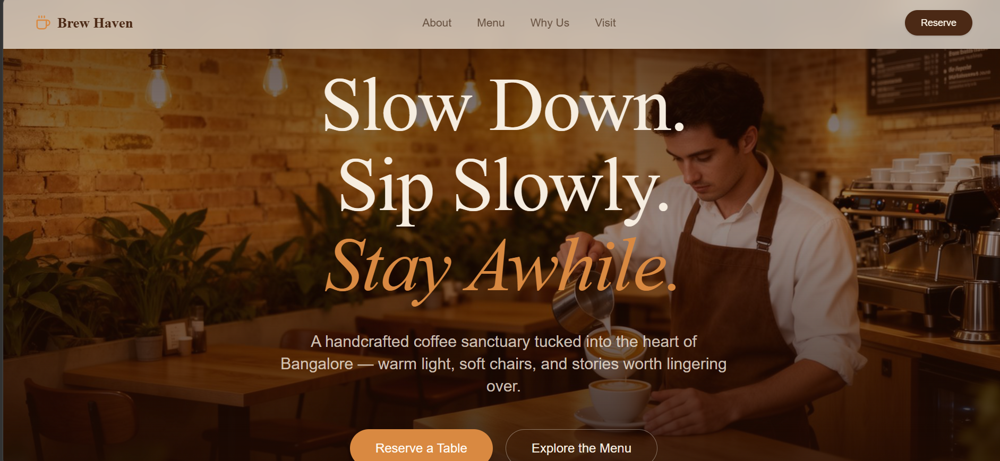
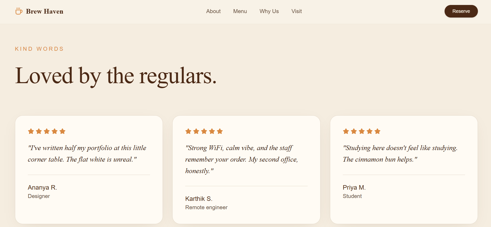
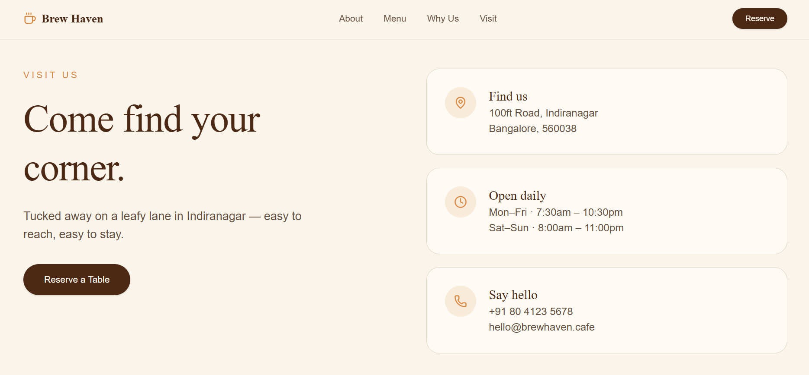
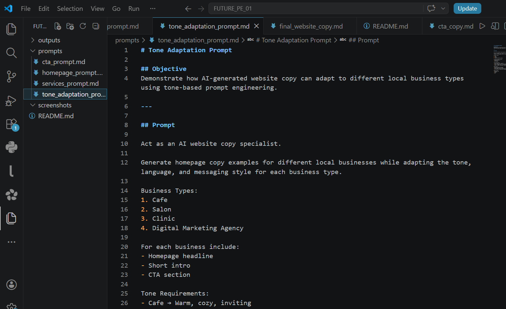

# AI Website Copy Generator for Local Businesses

## Project Overview

This project demonstrates how Prompt Engineering and AI tools can generate professional, conversion-focused website copy for local businesses.

The project was built using structured prompts to create homepage content, service descriptions, CTA sections, and tone-adapted website messaging for different industries.

The chosen business for this project is:

## Brew Haven Cafe, Bangalore

A modern, cozy, work-friendly cafe designed for students, coffee lovers, remote workers, and casual meetups.

---

# Objective

The goal of this project was to build a reusable AI prompt framework capable of:

- Generating homepage website copy
- Writing persuasive service page content
- Creating strong call-to-action sections
- Adapting tone for different business types
- Producing website-ready marketing content

---

# Tools Used

- ChatGPT
- Claude
- Google Gemini
- GitHub
- Markdown

---

# Project Features

✔ Conversion-focused homepage copy  
✔ Service page content tailored to business type  
✔ Persuasive CTA generation  
✔ Tone adaptation for multiple industries  
✔ Structured prompt engineering workflow  
✔ Website-ready AI-generated content  

---

# Folder Structure

```bash
FUTURE_PE_01/
│
├── README.md
│
├── prompts/
│   ├── homepage_prompt.md
│   ├── services_prompt.md
│   ├── cta_prompt.md
│   └── tone_adaptation_prompt.md
│
├── outputs/
│   ├── homepage_copy.md
│   ├── services_copy.md
│   ├── cta_copy.md
│   └── final_website_copy.md
│
└── screenshots/
```

---

# Prompt Engineering Logic

The prompts were structured to:

1. Define the business clearly
2. Identify target audience and customer intent
3. Control tone and emotional style
4. Generate persuasive and conversion-focused copy
5. Ensure reusable prompts for multiple business categories
6. Produce realistic, website-ready content

---

# Business Types Covered

- Cafe
- Salon
- Clinic
- Digital Marketing Agency

---

# Deliverables

✔ Homepage copy  
✔ Services page content  
✔ CTA sections  
✔ Tone adaptation examples  
✔ Structured prompts  
✔ Public GitHub repository  

---

# Outcome

This project demonstrates how AI-assisted copywriting and prompt engineering can help local businesses create professional website content faster and more efficiently.

It also showcases practical applications of AI in:
- Marketing
- Website content generation
- Branding
- Customer communication
- Digital business workflows

---

# Project Screenshots

## AI-Generated Cafe Website Mockup

### Hero Section



---

### Testimonials Section



---

### Contact Section



---

## Tone Adaptation Examples



# Author

Mahek Sultana